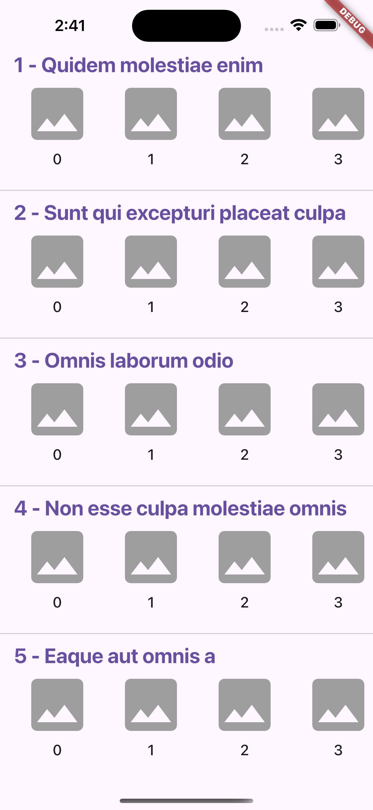
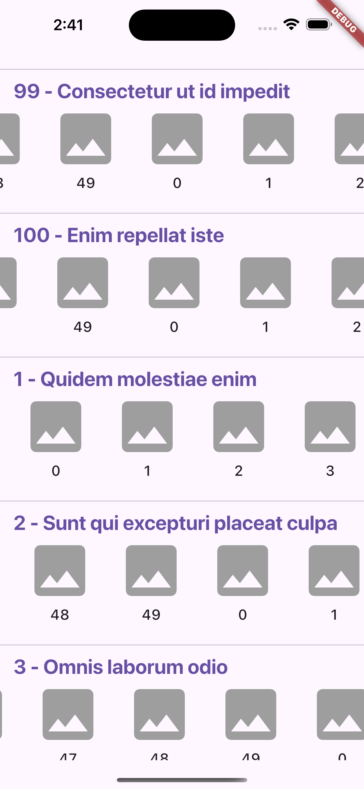

# Json Placeholder Apis Infinite Scroll Application

A modern infinite scroll on both directions for an Album Like Screen.

## 🚀 Getting Started

### Prerequisites

- Flutter SDK (latest stable version)
- Dart SDK (latest stable version)
- VS Code or Android Studio
- Git

### Command To run Code in Debug Mode

```bash
flutter run
```

## ✅ All Features Implemented

- ✅ Infinite Scroll - scrollable up/down/left/right
- ✅ Local Caching - Caching added after 1st api call

## 📱 Mobile Screenshots

<table style="width: 100%; text-align: center; border-collapse: collapse;">
  <tr>
    <td>Mobile Home Page Initial</td>
    <td>Mobile Scroll up/down/left/right</td>
  </tr>
  <tr>
    <td></td>
    <td></td>
  </tr>
</table>

### Setup Instructions

1. Clone the repository:

```bash
git clone "https://github.com/abhinav503/jsonplaceholder_infinite_scroll"
cd jsonplaceholder_infinite_scroll
```

2. Install dependencies:

```bash
flutter pub get
```

4. Run the application:

```bash
flutter run
```

## 🏗️ Project Structure

The project follows Clean Architecture principles and Atomic Design methodology:

```
lib/
├── core/
│   ├── base/
│   │   ├── base_exception_model.dart
│   │   ├── base_page.dart
│   │   └── base_screen.dart
│   ├── colors/
│   │   └── app_colors.dart
│   ├── constants/
│   │   ├── api_constants.dart
│   │   └── string_constants.dart
│   ├── di/
│   │   └── injection_container.dart
│   ├── model_to_entity_mapper/
│   │   └── mapper.dart
│   ├── models/
│   │   ├── api_failure_model.dart
│   │   └── no_param_model.dart
│   ├── network_repository/
│   │   ├── network_repository.dart
│   │   └── network_repository_impl.dart
│   ├── shared_preference/
│   │   └── shared_preference_service.dart
│   │   └── shared_preference_service_impl.dart
│   ├── ui/
│   │   ├── atoms/
│   │   │   └── custom_icon_widget.dart
│   │   ├── molecules/
│   │   │   └── custom_network_image.dart
│   │   └── templates/
│   │       └── album_widget.dart
│   ├── usecase/
│   │   └── usecase.dart
│   └── utils/
│       └── utils_mixin.dart
├── features/
│   └── home/
│       ├── data/
│       │   ├── data_source/
│       │   │   ├── home_data_source.dart
│       │   │   └── home_data_source_impl.dart
│       │   │   ├── home_local_data_source.dart
│       │   │   └── home_local_data_source_impl.dart
│       │   ├── models/
│       │   │   ├── album_model.dart
│       │   │   └── photo_model.dart
│       │   └── respository_impl/
│       │       └── home_repository_impl.dart
│       ├── domain/
│       │   ├── entities/
│       │   │   ├── album_entity.dart
│       │   │   └── photo_entity.dart
│       │   ├── repository/
│       │   │   └── home_repository.dart
│       │   └── usecase/
│       │       ├── get_albums_usecase.dart
│       │       └── get_photos_usecase.dart
│       └── presentation/
│           ├── bloc/
│           │   ├── home_bloc.dart
│           │   ├── home_event.dart
│           │   └── home_state.dart
│           └── views/
│               ├── home_page.dart
│               └── home_screen.dart
└── main.dart
```

### Architecture Overview

- **Clean Architecture**: Separation of concerns with distinct layers (PRESENTATION, DOMAIN, DATA)
- **Atomic Design**: UI components organized as ATOMS, MOLECULES, and ORGANISMS & TEMPLATES
- **BLoC Pattern**: State management using Flutter BLoC
- **Reusable Widgets**: ReUsable Widget

## 🛠️ Technology Stack

### Framework & Libraries

- **Flutter**: Cross-platform UI framework
  - Chosen for its performance, hot reload capability, and single codebase for multiple platforms
- **flutter_bloc**: State management
  - Provides predictable state management and separation of concerns
- **flutter_screenutil**: Responsive UI
  - Ensures consistent UI across different screen sizes
- **get_it**: Dependency Injection
